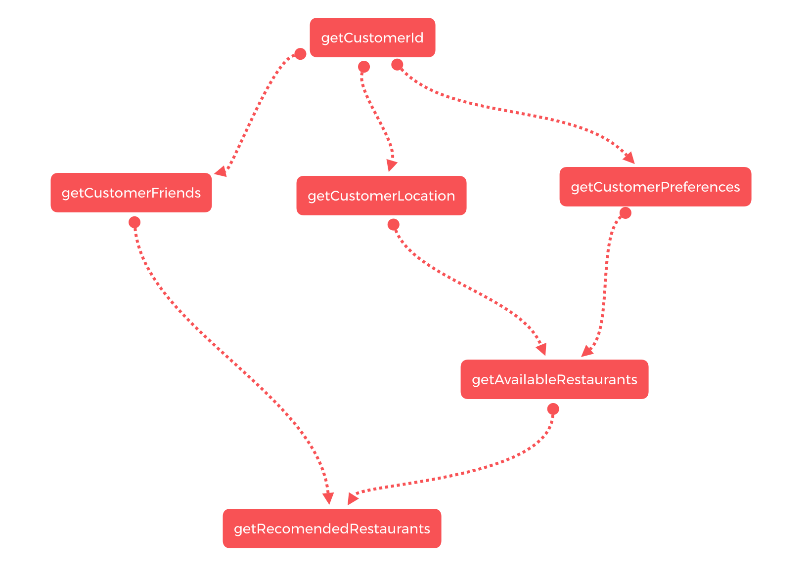

<a href="https://travis-ci.org/wix-incubator/async-graph-resolver"></a>

# async-graph-resolver
A utility to handle execution and aggregation of async actions.

## Introduction

Main goal of this utility is to simplify execution and aggregation of results of asynchronous operations with complicated dependencies in more straightforward way without sacrificing efficiency.

This is especially relevant when extending your flow with new async dependecies in already complicated flows.

Main goal of `async-graph-resolver` util is to provide a way to organize asyncronous actions in a form of graph. Which in turn provides better extendability and simplifies representation of complex dependencies.

## Usage

Async graph resolver shines in cases when you have a bunch of asynchronous requests or actions that have dependent requests. Maintaining such requests can become very clumsy especially when you have more than 10 requests with sub dependencies going 3-4 levels deep. This is very common on some node servers designed to aggreagate a bunch of data from some RPC calls and API requests.

### Install

`npm i async-graph-resolver`

### API

`AsyncNode` - is an object that describes structure of each graph node, and since it's only
- `id: string` - unique string indentifier for each node
- `run: function(dependecies: Object): Promise<any>` - function to run asyncronous operation to resolve this node's value. If current node has dependencies it recieves them as a key value object map.
- `dependencies?: string[]` - optional array of unique ids to specify which nodes this node depend on, result of those nodes will be provided to `run` function as an argument.

`AsyncGraph` - the main entity exposed by the library
- `constructor(): AsyncGraph` - constructor for AsyncGraphs
- `addNode(node: AsyncNode) AsyncGraph` - add async node to the graph. Returns updated graph to easily chain consecutive `addNode` calls. This function throws `Error` in case node with such id exists or adding this node will result in circular dependencies.
- `resolve(): Promise<any>` - initiate graph resolving, returns Promise fulfilled with object map of node resolvement values by node id or first failure encountered. Trying to resolve invalid graph (if it nodes with non-existent dependencies) will result in runtime error.

### Examples
Let's see an example where we need to build following flow of async actions



```javascript
//Without using AGR(Optimized)
const raffledCustomerId = await getRaffledCustomerId();

const customerPreferencesPromise = getCustomerPreferences(raffledCustomerId);

const customerLocationPromise = getCustomerLocation(raffledCustomerId);

const availableRestaurantsPromise = Promise.all([customerPreferencesPromise, customerLocationPromise])
  .then(results => getAvailableRestaurants(results[0], results[1]));

const customerFriendsPromise = getCusomterFriends(raffledCustomerId);

const recommendedRestaurantsPromise = Promise.all([customerFriendsPromise, availableRestaurantsPromise])
  .then(results => getRelevantRestaurants(results[0], results[1]));

const result = {
  raffledCustomerId,
  customerPreferences: await customerPreferencesPromise,
  customerLocation: await customerLocationPromise,
  availableRestaurants: await availableRestaurantsPromise,
  customerFriends: await customerFriendsPromise,
  recommendedRestaurants: await recommendedRestaurantsPromise
};

//Using AGR
import { AsyncGraph } from 'async-graph-resolver';

const relevantRestaurantsGraph = new AsyncGraph()
  .addNode({
    id: 'raffledCustomerId',
    run: () => getRaffledCustomerId()
  })
  .addNode({
    id: 'customerPreferences',
    run: ({raffledCustomerId}) => getCustomerPreferences(raffledCustomerId),
    dependancies: ['raffledCustomerId']
  })
  .addNode({
    id: 'customerLocation',
    run: ({raffledCustomerId}) => getCustomerLocation(raffledCustomerId),
    dependancies: ['raffledCustomerId']
  })
  .addNode({
    id: 'availableRestaurants',
    run: ({customerPreferences, customerLocation}) => getAvailableRestaurants(customerPreferences, customerLocation),
    dependancies: ['customerPreferences', 'customerLocation']
  })
  .addNode({
    id: 'customerFriends',
    run: ({raffledCustomerId}) => getCusomterFriends(raffledCustomerId),
    dependancies: ['raffledCustomerId']
  })
  .addNode({
    id: 'recommendedRestaurants',
    run: ({customerFriends, availableRestaurants}) => getRelevantRestaurants(customerFriends, availableRestaurants),
    dependancies: ['customerFriends', 'availableRestaurants']
  })

const result = await relevantRestaurantsGraph.resolve();
```
